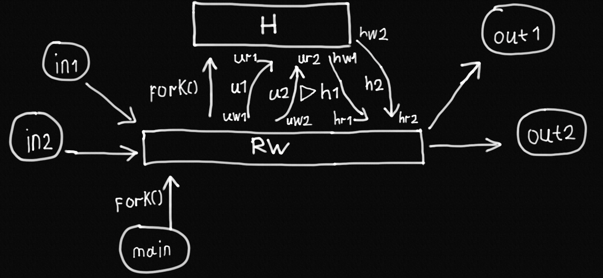
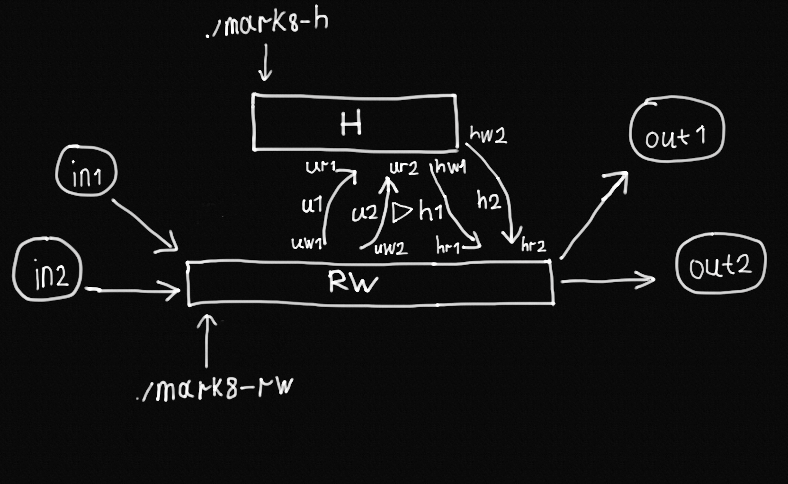

# 4 балла

## Информация об исполнителе
см. `README.md`

## Условие задачи
см. `README.md`

`$ make mark4` для сборки.  

## Общая схема решаемой задачи

- `in1`, `in2` - файлы с входной строкой.
- `out1`, `out1` - файлы с выходными строками.
- `main` - главный процесс из main(), последовательно создающий все дочерние процессы через `fork()`.  
  Процессы создаются таким образом, что следующий дочерний процесс создается только после того как текущий дочерний процесс завершил свою работу.
- `R` - дочерний процесс читателя; читает строки из файлов `in1` и `in2`.
- `H` - дочерний процесс обработки данных.
- `W` - дочерний процесс писателя; записывает строки в файлы `out1` и `out2`.
- `u1`, `u2` - два неименованных канала для передачи необработанных данных от читателя к обработчику данных, каждый для одной входной строки.
- `h1`, `h2` - два неименованных канала для передачи обработанных данных от обработчика данных до писателя, каждый для одной выходной строки.
- `uw1`, `uw2` - файловые дескрипторы, создающиеся неименованными каналами `u1` и `u2` на запись; используются читателем для передачи входных строк обработчику данных.
- `ur1`, `ur2` - файловые дескрипторы, создающиеся неименованными каналами `u1` и `u2` на чтение; используются обработчиком данных для получения входных строк от читателя.
- `hw1`, `hw2` - файловые дескрипторы, создающиеся неименованными каналами `h1` и `h2` на запись; используются обработчиком данных для передачи выходных строк писателю.
- `hr1`, `hr2` - файловые дескрипторы, создающиеся неименованными каналами `h1` и `h2` на чтение; используются писателем для получения выходных строк от обработчика данных.

## Запуск программы и ввод данных
Используйте команду `./mark4 <input_file_1> <input_file_2> <output_file_1> <output_file_2>` для запуска программы, где:
- `<input_file_1>`: путь к файлу с входной строкой 1.
- `<input_file_2>`: путь к файлу с входной строкой 2.
- `<output_file_1>`: путь к файлу, в который будет записана выходная строка 1.
- `<output_file_2>`: путь к файлу, в который будет записана выходная строка 2.

Для ввода и вывода данных было решено использовать два файла. Это связано с тем, что программа принимает две входные строки и выдает две выходные строки, при этом на содержание этих строк не накладываются никакие ограничения. Для того чтобы реализовать ввод с одного файла прийдется определять специальный символ-разделитель для корректно обработки строк. При этом, если такой символ-разделитель будет находиться в одной из входных строк, то корректно разделить строку не получится. Для решения этой проблемы используются два файла для ввода строк и два файла для вывода строк.    

## Тестовые файлы
Тестовый набор состоит из 4 файлов:
- `in1`: первая входная строка.
- `in2`: вторая входная строка.
- `out1`: первая выходная строка (результат разницы 1-ой входной строки со 2-ой).
- `out2`: вторая выходная строка (результат разницы 2-ой входной строки с 1-ой).

Входные данные шести тестовых наборов представлены в `./src/test/in/`:
- `1`: Типичный тестовый набор на данных небольшого размера; корректность ответа легко проверяется вручную. 
- `2`: Типичный тестовый набор на данных небольшого размера; корректность ответа легко проверяется вручную. 
- `big`: Тестовый набор на данных большего размера.
- `distinct`: Тестовый набор со входными строками, где каждый символ одной строки не входит в другую (т. е. пересечение входных строк - пустое множество); таким образом, корректный ответ - набор символов для каждой их входных строк (без исключения какого-либо символа); корректный ответ соответствует представленному.
- `equal`: Тестовый набор на одинаковых входных строках; таким образом, корректный ответ - пустая строка (пустое множество); корректный ответ соответствует представленному
- `lorem`: Типичный тестовый набор на одной входной строке среднего размера и второй входной малого размера. Во второй входной строке все символы представлены в первой: вторая выходная строка должна быть пустой.  

Выходные данные шести тестовых наборов представлены в `./src/test/out/`.  
Для данной программы выходные данные будут находиться в `mark4`. 

## Ремарки о программе
Для создания анонимных каналов используется функция pipe().   
Для создания дочерних процессов используется функция fork().  
Реализовано цикличное запись-чтение для процессов чтения, обработки данных, записи.  
Размер буфера контролируется `#define BUFFER_SIZE` и равен `8192`.  
Ввод и вывод данных при работе с файлами осуществляется через системные вызовы read и write.  
Для простого управлениями ресурсами (а именно, закрытиями файловых дескрипторов) было принято решение использовать паттерн `goto cleanup` (см. код и https://eli.thegreenplace.net/2009/04/27/using-goto-for-error-handling-in-c). Считается, что в данном случае использование `goto` вполне оправданно и ведет к более читабельному коду.  

# 5 баллов
*Далее FIFO - именованный канал*

`$ make mark5` для сборки.  

## Общая схема решаемой задачи
Общая схема решаемой задачи аналогична представленной на 4 балла.  

Однако, в данном случае:
- `u1`, `u2` - два FIFO для передачи необработанных данных от читателя к обработчику данных, каждый для одной входной строки.
- `h1`, `h2` - два FIFO для передачи обработанных данных от обработчика данных до писателя, каждый для одной выходной строки.
- `uw1`, `uw2` - файловые дескрипторы, открывающиеся читателем для FIFO `u1` и `u2` на запись.
- `ur1`, `ur2` - файловые дескрипторы, открывающиеся в родительском процессе (в `main`) для FIFO `u1` и `u2` на чтение, и, впоследствии, передающиеся обработчику данных.
- `hw1`, `hw2` - файловые дескрипторы, открывающиеся обработчиком данных для FIFO `h1` и `h2` на запись.
- `hr1`, `hr2` - файловые дескрипторы, открывающиеся в родительском процессе (в `main`) для FIFO `h1` и `h2` на чтение, и, впоследствии, передающиеся писателю.

Заметим, что писатель не открывает ни одного FIFO, использую файловые дескрипторы `hr1` и `hr2`, открытые еще до запуска процесса писателя в родительском процессе (в `main`).  

Имена FIFO:
- `u1` - `"unhandled_1.fifo"`
- `u2` - `"unhandled_2.fifo"`
- `h1` - `"handled_1.fifo"`
- `h2` - `"handled_2.fifo"`

При открытии FIFO файла через open() с режимом только записи (`O_WRONLY`)/только чтения (`O_RDONLY`), open() будет блокировать программу, пока 
другой процесс не откроет этот же FIFO в противоположном режиме. Стоит отметить, что флаг `O_NONBLOCK` не помогает в данном случае; при его использовании вместо ожидания открытия FIFO в другом процессе open() сразу же завершается с ошибкой `ENXIO`. Именно поэтому программа должна быть устроена таким образом, что при открытии FIFO в одном процессе, другой процесс должен сам открывать этот же FIFO. При последовательном выполнении дочерних процессов наиболее легкий способ сделать это - создать FIFO в `main` перед созданием дочерних процессов через fork(); открыть FIFO в дочернем процессе и открыть этот же FIFO в главном процессе (в `main`), уже после функции fork() и блока кода, относящегося только к дочернему процессу, но до вызова функции wait(). Программа осуществляет данный способ создания FIFO.

FIFO создаются через функцию `mkfifo(const char* path, mode_t mode)`, где:
- `path` - путь к новому FIFO файлу,
- `mode` - `0666`.

## Тестовые файлы

Использованы входные данные тестовых наборов из `./src/test/in`.  
Для данной программы выходные данные представлены в `./src/test/out/mark5/`.  
Выходные данные совпадают с выходными данными, полученными программой на 4 балла.  

## Ремарки о программе
Файлы с FIFO (созданные через функцию mkfifo()) не удаляются после завершения программы.  
Для удаления можно использовать `$ make clean`.

# 6 баллов

`$ make mark6` для сборки.  

## Общая схема решаемой задачи

- `RW` - процесс читатель-писатель, где производится вся работа. Здесь создаются и закрываются все неименованные каналы.
- `H` - процесс обработки данных. Создается через `fork()` в `RW` после создания всех неименованных каналов.
- `u1`, `u2` - два неименованных канала, каждая передающая входную строку из процесса `RW` в процесс `H`.
- `h1`, `h2` - два неименованных канала, каждая передающая входную строку из процесса `H` в процесс `RW`.

"Направленный треугольник" между каналами `u2` и `h1` означает, что `RW` ждет завершения работы `H`, прежде чем начать читать данные из каналов `h1` и `h2`.   

Задание просит указать имена каналов (*хоть они и "неименованные"*):
- `u1` - "unhandled_data_fds_1"
- `u2` - "unhandled_data_fds_2"
- `h1` - "handled_data_fds_1"
- `h2` - "handled_data_fds_2"

Все неименованные каналы создаются в `RW` через функцию `pipe(int pipe_fds[2])`, при удачном завершении функции, в `pipe_fds[0]` сохраняется файловый дескриптор, из которого можно прочитать из данного канал; в `pipe_fds[1]` сохраняется файловый дескриптор, в который можно записать в данный канал.

## Тестовые файлы

Использованы входные данные тестовых наборов из `./src/test/in`.  
Для данной программы выходные данные представлены в `./src/test/out/mark6/`.  
Выходные данные совпадают с выходными данными, полученными программой на 5 баллов.  

# 7 баллов

`$ make mark7` для сборки.  

## Общая схема решаемой задачи

Общая схема решаемой задачи аналогична представленной на 6 баллов.  

Однако, в данном случае:
- `RW` - процесс читатель-писатель, где производится вся работа. Здесь создаются все именованные каналы.
- `H` - процесс обработки данных. Создается через `fork()` в `RW` после создания всех именованных каналов.
- `u1`, `u2` - два именованных канала, каждая передающая входную строку из процесса `RW` в процесс `H`.
- `h1`, `h2` - два именованных канала, каждая передающая входную строку из процесса `H` в процесс `RW`.

Имена FIFO:
- `u1` - "unhandled_1.fifo"
- `u2` - "unhandled_2.fifo"
- `h1` - "handled_1.fifo"
- `h2` - "handled_2.fifo"

`H` последовательно открывает `ur1`, `ur2`, `uw1`, `uw2`. При этом, `RW` после сразу же после создания `H` открывает только `uw1` и `uw2`, и сразу же после этого начинает читать входные строки из файлов. Только после успешного прочтения входных строк `RW` открывает оставшиеся `hr1` и `hr2`. Это позволяет `H` заблокироваться на открытии `hw1` (ожидая пока другой процесс откроет `hr1`) и дать `RW` полностью прочитать строки, чтобы они были готовы быть прочитанными `H`. Только после открытия `hr1` и `hr2` процессом `RW`, `H` продолжает работу, начиная обработку строк. После этого `RW` ждет пока `H` завершиться, и при успешном завершении записывает результаты в файлы.  

FIFO создаются через функцию `mkfifo(const char* path, mode_t mode)`, где:
- `path` - путь к новому FIFO файлу,
- `mode` - `0666`.

## Тестовые файлы

Использованы входные данные тестовых наборов из `./src/test/in`.  
Для данной программы выходные данные представлены в `./src/test/out/mark7/`.  
Выходные данные совпадают с выходными данными, полученными программой на 6 баллов.

## Ремарки о программе

Файлы с FIFO (созданные через функцию mkfifo()) не удаляются после завершения программы.  
Для удаления можно использовать `$ make clean`.

# 8 баллов

## Запуск программ
`$ make mark8` для сборки.  
Для запуска программ используйте:
- `./mark8-rw <input_file_1> <input_file_2> <output_file_1> <output_file_1>` - для запуска программы читателя-писателя (*первый процесс*).
- `./mark8-h` - для запуска программы обработчика данных (*второй процесс*).

Запускайте программы в порядке `./mark8-rw` -> `./mark-h`

## Общая схема решаемой задачи  
  

В данном случае:
- `RW`, `H` - процессы, запускающиеся отдельно (*например, в разных терминалах*)

В `RW` создаются все именованные каналы, поэтому он должен запускаться первым (*если каналы еще не созданы*).  
`RW` сначала открывает только `uw1` и `uw2`, блокируя `H` на вызове `open()` для `hw1`. Затем, `RW` читает файлы и записывает строки в `uw1` и `uw2`, после успешной передачи открывает `hr1` и `hr2`, тем самым разблокировав выполнение `H`. `H` принимает строки и записывает результаты в `hw1` и `hw2`; `RW` записывает результаты в файлы.  

## Тестовые файлы

Использованы входные данные тестовых наборов из `./src/test/in`.  
Для данной программы выходные данные представлены в `./src/test/out/mark8/`.  
Выходные данные совпадают с выходными данными, полученными программой на 7 баллов.

## Ремарки о программе

Файлы с FIFO (созданные через функцию mkfifo()) не удаляются после завершения программы.  
Для удаления можно использовать `$ make clean`.
